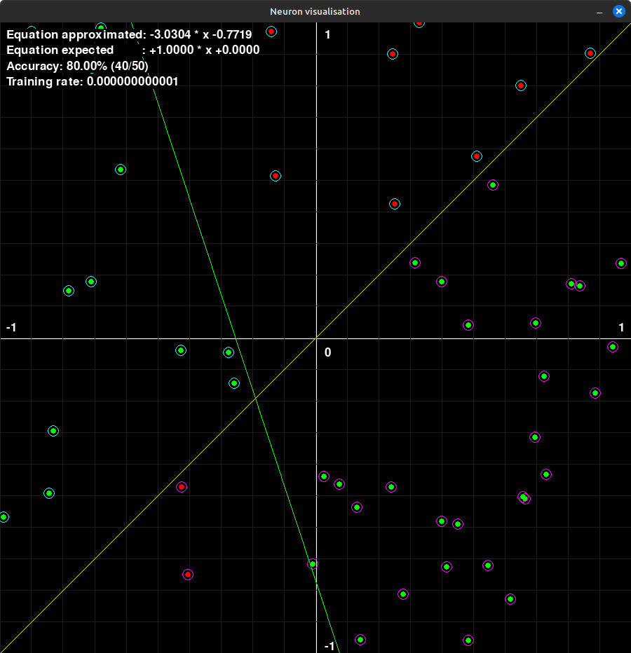

# Neuron learning visualisation

## Introduction



(inspired by: https://www.youtube.com/watch?v=DGxIcDjPzac)

POC to visualize how to a single neuron is learning.

In this POC, we can imagine that each point represents a flower with cyan or magenta color, the color repartition of each flower depends on its size and its petals count defined by a "God rule" equation.

The neuron's goal is to discover this "God rule".

## How to install

```
pip install -r Requirements.txt
```

## How to run

You can simply run with the default "God rule" equation (`1x+0`):

```
$> ./App.py
```

You can specify the equation of the "God rule" in parameters:

```
$> ./App.py 0.42x-0.42
```

### How to use

#### Commands
 - ESCAPE or 'q' => Quit the program
 - 'r'           => Reset Neuron and Points
 - 'c'           => Remove all Points (keep Neuron's training)
 - 'a'           => Add some Points
 - UP            => Increment training rate (equation move slower with high precision)
 - DOWN          => Decrement training rate (equation move fast with low precision)
